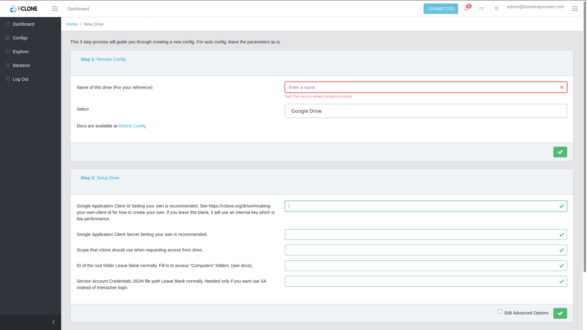

# Rclone Web UI - Google Summer of Code '19 

This is a reactjs based web UI for the rclone cli project @ [Rclone Website](rclone.org)  

This project can be unstable and is being actively developed. Feel free to create any issues, feature requests or enhancements as you encounter them. 

## Build Status

[](https://travis-ci.com/negative0/rclone-webui-react) [](https://greenkeeper.io/)

## Getting Started

The project currently requires you to install and configure react and npm to run correctly

## Screenshots
### Dashboard


### Login


### Remote Explorer


### Creating config



### Get the Project
```
    git clone https://github.com/negative0/rclone-webui-react
```
OR download a zip from the option above.

### Install dependencies
```
  cd <cloned directory>
  npm install 
```

### Run the project
```
  npm start
```

### Run Rclone
You have to run rclone with the following flags:
```
    rclone rcd --rc-user=<username> --rc-pass=<password> --rc-serve
```
Replace username and password with your custom username password. This will be required to login to rclone.

--rc-serve:  It serves the remote objects at localhost:5572/[remoteName:remotePath]/path/to/file. It enables us to download files via the RemoteExplorer through the browser.

## Progress

For the progress and future implementation details please refer Progress.md


