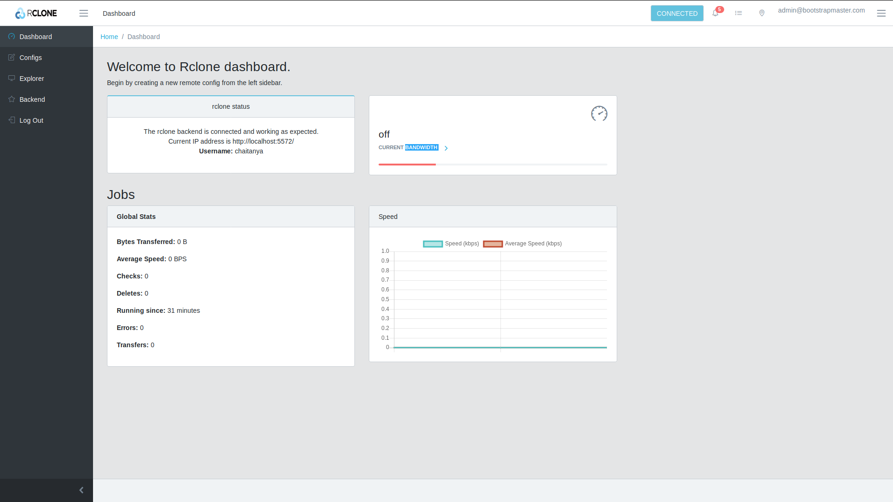
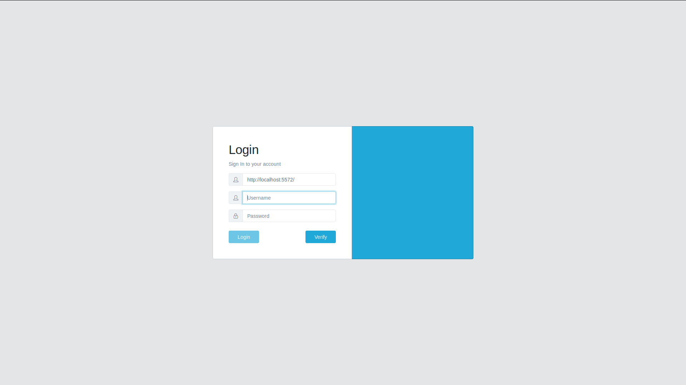
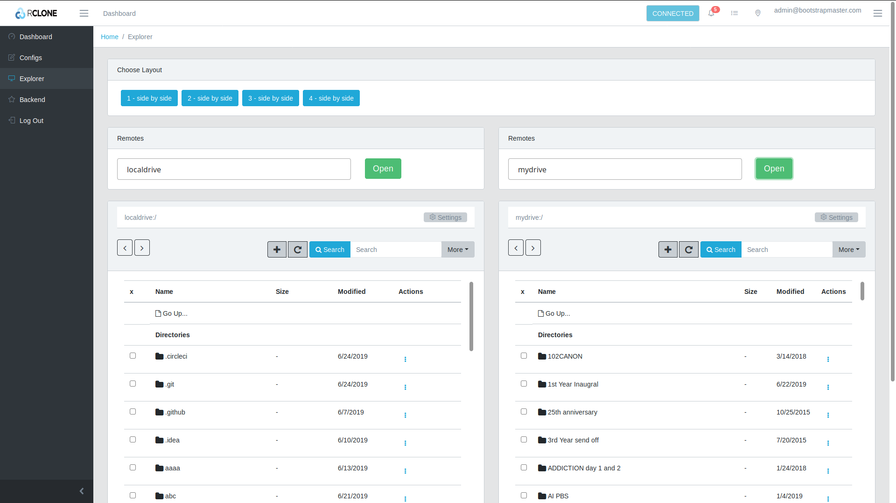

# Rclone Web UI  [](https://summerofcode.withgoogle.com/projects/#5104629795258368) [](https://www.ccextractor.org/) [](https://rclone.org/)

**Latest hosted release:** https://rclone.github.io/rclone-webui-react


## Build Status


[](https://coveralls.io/github/rclone/rclone-webui-react?branch=master)

## About

This project under development as a part of Google Summer of Code 2019 and 2020 under [ccextractor.org](https://ccextractor.org) and [rclone.org](https://rclone.org) by [negative0](https://github.com/negative0).

This is a reactJS based web UI for the rclone cli project @ [Rclone Website](https://rclone.org/)  

### Work Products (GSoC 2019):

- Proposal for developing this project: [here](https://docs.google.com/document/d/1l6OHrM2XemHP-l2_iBdYPdPNVgiSB5t1es_-0ogrty0/edit?usp=sharing)
- The latest automated build can be found here: http://rclone.github.io/rclone-webui-react
- GSoC phase I plan: [here](http://good2be.me/blog/gsoc-phase-i.html)
- The thread for beta testing is here: https://forum.rclone.org/t/beta-testing-webgui-for-rclone/11156

## Intro

This project is being actively developed. Feel free to create any issues, feature requests or enhancements as you encounter them. 

## Getting Started

The project currently requires you to install and configure react and npm to run correctly.

## Running the project through rclone:

If you have rclone installed, you can easily run this UI through rclone without any additional configuration.

**Note: The instructions for installing rclone can be found [here](https://rclone.org/install/).**

To run the web-gui, simply run the following command:

```shell script
rclone rcd --rc-web-gui --rc-user=<user> --rc-pass=<pass> 
```
The web-gui should now be available at the url http://localhost:5572

You may have to clear the browser local storage if needed, after switching to the older version.

## Alternatively, you can use the hosted version:
With every release, we publish it to github-pages. You can directly use it without installing rclone locally.

Head over to https://rclone.github.io/rclone-webui-react/. To login, enter the IP address, username and password of rclone rc server.

While running the rclone rc server, use the following command,
```
rclone rcd --rc-user=abc --rc-pass=abcd --rc-allow-origin="https://rclone.github.io" 
```
replace the username and password with your liking. If you are not comfortable with specifying it here, use the .htpasswd option.

```
rclone rcd --rc-allow-origin="https://rclone.github.io" --rc-htpasswd /path/to/.htpasswd
```

### Parameters:
--rc-web-gui - run the web-gui

--rc-user - username to be used for login (Optional) default is gui.

--rc-pass - password to be used for login (Optional) if not provided, rclone will generate one for you.

--rc-addr - useful if you are running rclone on a headless machine, specify the private/public IP of your VM for rclone to bind to. (Optional)

--rc-web-gui-update - Force update web-gui to the latest version.


## Screenshots
### Dashboard


### Login


### Remote Explorer


### Creating config


### Mounts


## Get the automated script and get running

**Bash users:**

Download the sh file given here: 
[webui.sh](https://raw.githubusercontent.com/rclone/rclone-webui-react/master/webui.sh)

Copy the file to root folder of rclone.

```
cp webui.sh <root-of-rclone>/
```
First of all open the webui.sh

You need to edit this code to the username and password you would like to use.
```
username='<your-username>'
password='<your-password>'
```
Save this file.

Now you can run the following commands:

- Download the project:
```
./webui.sh get
```

- Build the webui app:
```
./webui.sh build
```

- Run the app with rclone backend:
```
./webui.sh run
```

- At any point, you can update the webui with new changes from the repo (optional):

```
./webui.sh update
```


### Get the Project
```
    git clone https://github.com/rclone/rclone-webui-react
```
OR download a zip from the option above.

### Install dependencies
If you are using NPM:

**Make sure that you are using the latest LTS version of NPM**
```
    cd <cloned directory>
    npm install 
```

Using yarn:
```explorer
    cd <cloned directory>
    yarn install
```


### Run the project
```
    npm start
```
OR
```
    npm run start
```

### Run tests
```npm test```OR ```yarn test``` if you want to run all jest tests. 
Test specific environment can be set using setupTests.js

**With Coverage**: ```npm run test:cov```


### Run Rclone
You have to run rclone with the following flags:
```
    rclone rcd --rc-user=<username> --rc-pass=<password> --rc-serve
```
Replace username and password with your custom username password. This will be required to login to rclone. rc-no-auth is not available due to security concerns.

--rc-serve:  It serves the remote objects at localhost:5572/[remoteName:remotePath]/path/to/file. It enables us to download files via the RemoteExplorer through the browser.

## Progress

For the progress and future implementation details please refer Progress.md


